# Sovol-SV08-Mainline
USE THE MAIN REPO FOR STABILITY >>> [Rappetor/Sovol-SV08-Mainline](https://github.com/Rappetor/Sovol-SV08-Mainline)

Getting the Sovol SV08 onto mainline Klipper

This repository will describe installing mainline/regular klipper (via KIAUH) on your Sovol SV08 with the BTT CB1 image.<br>

Run it from either eMMC or SD card, you choose.<br>

**TL;DR**: _make a backup of klipper config, remove the eMMC from the printer, write CB1 image to eMMC, change BoardEnv.txt and system.cfg, put the eMMC back in the printer, install KIAUH; klipper, moonraker, and mainsail (and optional extras), create firmware(s), flash the tool head MCU and board MCU. DONE!_

<br>

# READ ME FIRST!

<h3>Video Guides can be out of date. Please always refer to this repo as the main source for up to date information.</h3>
<h3>WE ARE NOT RESPONSIBLE FOR DAMAGE TO YOUR PRINTER.</h3>

<p>That being said, all steps have been thoroughly tested by multiple people in the community. Please follow the steps exactly and carefully and you will have a good working printer at the end. If you get stuck at some point or have any questions please create an issue or find support on the Sovol (official and unofficial) Discord.</p>

<br><br>

This guide uses color codes to showcase important info.

> [!CAUTION]
> If you see text inside a red box, you NEED to read what is in the box.

> [!IMPORTANT]
> If you see text inside the purple box, it's an important piece of information.

> [!NOTE]
> If you see text inside a blue box, this info is typically a helpful tip or a useful note.

Ok, now you can continue.

## WORK IN PROGRESS

> [!NOTE]
> This is a work in progress, and some work needs to be done. You are the guinea pig ;) <br> Found something that doesn't work (properly), please share and contribute!

# INDEX

- [Prerequisites](#prerequisites)
- [STEP 1 - Removing The eMMC From The Printer](#step-1---removing-the-emmc-from-the-printer)
- [STEP 2 - Flashing Media](#step-2---flashing-media)
  - [METHOD 1: Write Image Directly To eMMC](#method-1-write-image-directly-to-emmc)
  - [METHOD 2: Write Image To SD -> eMMC](#method-2-write-image-to-sd---emmc)
- [STEP 3 - Changes To The BOARDENV.TXT & Setup WI-FI](#step-3---changes-to-the-boardenvtxt--setup-wi-fi)
- [STEP 4 - Install Mainline Klipper](#step-4---install-mainline-klipper)
- [STEP 5 - Configure Printer/Klipper & Addons](#step-5---configure-printerklipper--addons)
- [STEP 6 - Stock Firmware Backup](#step-6---stock-firmware-backup)
- [STEP 7 - Flash Katapult Bootloader](#step-7---flash-katapult-bootloader)
- [STEP 8 - Flash Klipper Firmware On MCUs](#step-8---flash-klipper-firmware-on-mcus)
- [Big Thanks & Contribute](#big-thanks--contribute)
- [Disclaimer](#disclaimer)

# PREREQUISITES

- First, create a **backup** of all the config files on your original Sovol SV08. You can do this in the web/mainsail interface -> Machine -> Select all files/folders -> Download.
  - Optionally you can also SSH or SFTP into your machine (port: 22, username/password: sovol/sovol) and backup additional .sh scripts in the /home/sovol/ folder.
  - For example use [PuTTY](https://www.putty.org/) for SSH and [WinSCP](https://winscp.net/) for SFTP (_SSH File Transfer Protocol_).
- You WILL need the printer.cfg later in this process (for the /dev/serial/by-id/usb-Klipper*stm32f103xe* serials).
- You need either a '**Makerbase MKS EMMC-ADAPTER V2 USB 3.0**' USB adapter or '**Makerbase MKS MICROSD TO EMMC ADAPTER**' to be able to read/write the eMMC.
  - It is recommended to get yourself a separate **eMMC module** (MKS eMMC Module) on which you install the new OS Image and mainline klipper. This way you always have a backup (eMMC) of a working printer.
- If you go for the '_method 2_' you need a big enough **MicroSD card** (it's also possible to run everything from the SD card).
- You will need an ST-Link V2 (Mini) with the **STM32CubeProgrammer** software installed to be able to update/flash the MCU firmware.
- The files used for this guide can now be found together in the GitHub folder `/files-used/` [HERE](files-used/)

### EMMC Sellers

[QIDI (USA/EU/UK/CA/JP/AU)](https://qidi3d.com/products/x-max-3-x-plus-3-x-smart-3-emmc-32g)

[Aliexpress (China)](https://www.aliexpress.us/item/3256807073480438.html)

[Kingroon (China)](https://kingroon.com/products/upgrade-32gb-emmc-module-for-kingroon-kp3s-pro-v2-and-klp1)
<br>
> [!NOTE]
> Depending on which model you purchase you may also need a MicroSD card reader, follow the guide but when we mention the USB adapter you will need to use your MicroSD card reader along with the '**MICROSD TO EMMC ADAPTER**'

# STEP 1 - REMOVING THE eMMC FROM THE PRINTER

> [!CAUTION]
> POWER OFF AND UNPLUG THE PRINTER FROM THE OUTLET.

1. Put the printer on its back, so you have access to the underside of the printer.
2. Remove the metal plate by removing the 6 screws.
3. You can now see the eMMC module on the board, remove the 2 screws that are holding it in, and carefully remove the eMMC module.
   - Take note of the direction of the eMMC module (_hint; you can also see an arrow on the board which way the module goes_)

<br>

# STEP 2 - FLASHING MEDIA

First, download the BIGTREETECH CB1 Linux image (the original Sovol SV08 image was also based on this): [https://github.com/bigtreetech/CB1](https://github.com/bigtreetech/CB1/releases)

Here we can use 3 methods:

**Method 1**: Write the CB1 image directly to the eMMC and use it that way

**Method 2**: Write the CB1 image to an SD card and use that to get the CB1 image on the eMMC.

_**Method 3**: Choose to run everything from the SD card and stop at Method 2.2_

> [!TIP]
> Some people get an error while booting, or it doesn't want to boot at all, after writing the image with Balena Etcher. Some have had success writing the image with the `Raspberry Pi Imager` instead.

<br>

## METHOD 1: WRITE IMAGE DIRECTLY TO eMMC

1. Download the **MINIMAL** BIGTREETECH image. Careful, there's also a full image that has an unknown version of Klipper already installed. Go to: https://github.com/bigtreetech/CB1/releases
   - Used in this example: [CB1_Debian11_minimal_kernel5.16_20240319.img.xz](https://github.com/bigtreetech/CB1/releases/download/V2.3.4/CB1_Debian11_minimal_kernel5.16_20240319.img.xz)
2. Put the eMMC module in the USB adapter (again, mind the direction of the module, there is an arrow on the adapter) and put the USB adapter in your computer.
3. Use [BalenaEtcher](https://github.com/balena-io/etcher/releases) to write the image to the eMMC
   - Used in this example: balenaEtcher-win32-x64-1.19.21.zip (portable, so doesn't need an installer)
   - Open Balena Etcher<br>
     -> Choose "Flash from file", browse and choose the downloaded CB1 image<br>
     -> Select the eMMC drive (e.g. Generic USB STORAGE DEVICE USB device)<br>
     -> Flash! (this will erase everything on the eMMC!)
4. After the flash is complete you can close BalenaEtcher. If everything is alright you now see a FAT drive called 'BOOT' (if not, eject the USB adapter and put it back in)

_You can now continue to **STEP 3**_

<br>

## METHOD 2: WRITE IMAGE TO SD -> eMMC

1. Write the image to the eMMC chip
   - Used in this example: [CB1_Debian11_minimal_kernel5.16_20240319.img.xz](https://github.com/bigtreetech/CB1/releases/download/V2.3.4/CB1_Debian11_minimal_kernel5.16_20240319.img.xz)

2. Use [BalenaEtcher](https://github.com/balena-io/etcher/releases) to write the image to the **SD card**
   - Used in this example: balenaEtcher-win32-x64-1.19.21.zip (portable, so doesn't need an installer)
   - Open Balena Etcher<br>
     -> Choose "Flash from file", browse and choose the downloaded CB1 image<br>
     -> Select the **SD card** <br>
     -> Flash! (this will erase everything on the SD card!)<br>

> [!NOTE]
> _Sidenote here: you could, if you choose here, run the printer from the SD card and skip the whole eMMC. Just so you know ;-)_

3. Put the eMMC module in the USB adapter (again, mind the direction of the module, there is an arrow on the adapter) and put the USB adapter in your computer.<br>

4. We need to clear all the partitions from the eMMC (this will erase everything on the eMMC!) :
   - In Windows open the command prompt (Win-R -> cmd) and run `diskpart` (be careful with diskpart, we don't want to erase the wrong disk here!)
   - In diskpart do `list disk` and see what disk is your eMMC
   - In diskpart run `select disk <nr>` where <nr> is the number of your eMMC. Please make sure this is the correct disk before you continue!
   - In diskpart run `clean` and it will erase everything/all partitions from the eMMC disk.
   - In diskpart run `exit` to exit


_Please continue to **STEP 3** and then come back here!_

5. If everything is ok you should have booted from the SD card, and it's time to copy all the contents to the eMMC and make it bootable.
   - First, check if the eMMC is recognized and available:
     - Run the command `fdisk -l` and you should see some storage devices including the eMMC (_e.g. /dev/mmcblk1 for the SD card and /dev/mmcblk2 for the eMMC_).
   - Run the command `sudo nand-sata-install`:
     - Choose the option 'Boot from eMMC - system on eMMC'.
   - It will now create and format a partition (ext4) on the eMMC, and it will copy all its contents from the SD card to the eMMC.
   - When it's done power off the SV08, remove the SD card, and boot from the eMMC. If everything has gone correctly you should now boot from the eMMC and can continue with **STEP 4**.

<br>

# STEP 3 - CHANGES TO THE BOARDENV.TXT & SETUP WI-FI

To make the CB1 image setup correctly we need to copy a file and make a few changes to the BoardEnv.txt. Also, we need to set up Wi-Fi credentials (if not connected via ethernet) in the system.cfg

1. Please copy the `sun50i-h616-sovol-emmc.dtb` file from the `/files-used/dtb-files/` GitHub folder [HERE](files-used/dtb-files/) to your 'BOOT' drive `/dtb/allwinner/` folder.
2. Go to the 'BOOT' drive and make a **BACKUP** of 'BoardEnv.txt' on your hard disk just in case.
3. Open 'BoardEnv.txt' in your favourite text editor.
4. Replace the content ABOVE the `#--------#` line (we KEEP what is under there) with the following items _(see picture below, green = copy/pasted, red = don't touch and keep as it is)_:
   ```ini
   bootlogo=false
   overlay_prefix=sun50i-h616
   fdtfile=sun50i-h616-sovol-emmc
   console=display
   overlays=uart3
   overlays=ws2812
   overlays=spidev1_1
   ```
   It will now look something like this:<br>
   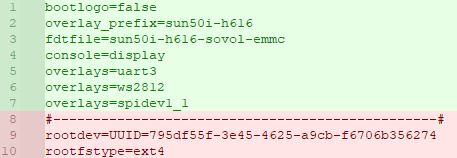
  > [!NOTE]
  > <sub>**NOTE 1**: by setting bootlogo=false you get the Linux boot messages on the HDMI display, if you set bootlogo=true you only see them when connecting a keyboard and pressing a key.</sub><br>
  <sub>**NOTE 2**: `fdtfile=sun50i-h616-sovol-emmc` supports both eMMC and SD cards but will, obviously, only boot from one (according to the BTT CB1 docs the SD card has priority over eMMC but there have been reports of it being the other way around; if it boots from eMMC and not the SD card please make sure the eMMC is empty or non-bootable or just remove it from the printer).</sub><br>
  

- Save your changed BoardEnv.txt!

5. Change the Wi-Fi credentials in the 'system.cfg'

   - Optional: uncomment the hostname and set the hostname to e.g. "SV08"
   - Save changes to the system.cfg

> [!IMPORTANT]
> if you are using an HDMI screen you will need to set the screen rotation to "inverted"


6. Eject the USB adapter from your computer then put the eMMC (and **SD card** in case of _method 2_) back into the printer and boot it, then:
   - SSH into the printer (find the IP address on your router or use the configured hostname), username/password: biqu/biqu
   - If everything is ok your printer will boot nicely, you can SSH into the printer, and you are done with this step and ready to install mainline Klipper. You can also continue _**Method 2**, point 5, and finalize writing the system to eMMC!_

<br>

# STEP 4 - INSTALL MAINLINE KLIPPER

Time for the fun stuff! Now we shall install KIAUH, Klipper, Moonraker, etc.
Please SSH into your printer and then do the following steps.

1. First, we will update the OS:<br>

   ```bash
   sudo apt update && sudo apt upgrade
   ```

2. Then install git (which might already be installed) and KIAUH with the following commands:

   ```bash
   sudo apt-get update && sudo apt-get install git -y
   ```

   ```bash
   cd ~ && git clone https://github.com/dw-0/kiauh.git
   ```

3. Start KIAUH with the following command :

   ```bash
   ./kiauh/kiauh.sh
   ```

4. Install Klipper, Moonraker, Mainsail, and Crowsnest (in this order) via KIAUH.

   - So run KIAUH and choose: option **'1) [Install]'** and install those items (_using default options, download recommended macros; Yes_).
   - Crowsnest install asks to reboot the printer, please do so.

> [!IMPORTANT]
> If you are using an HDMI screen, now is the time to install klipperscreen, do this BEFORE crowsnest so you dont have to reboot twice.


5. Install Numpy (needed for input shaping)

   ```bash
   sudo apt update
   sudo apt install python3-numpy python3-matplotlib libatlas-base-dev libopenblas-dev
   ~/klippy-env/bin/pip install -v numpy
   ```
6. Install _Moonraker-timelapse_
   - See [https://github.com/mainsail-crew/moonraker-timelapse](https://github.com/mainsail-crew/moonraker-timelapse) for detailed information.
   - First install moonraker-timelapse:
   ```bash
   cd ~/
   git clone https://github.com/mainsail-crew/moonraker-timelapse.git
   cd ~/moonraker-timelapse
   make install
   ```
   - Then edit your `~/printer_data/config/moonraker.conf` and add the following lines:
   ```ini
   [update_manager timelapse]
   type: git_repo
   primary_branch: main
   path: ~/moonraker-timelapse
   origin: https://github.com/mainsail-crew/moonraker-timelapse.git
   managed_services: klipper moonraker

   [timelapse]
   ##   Following basic configuration is default to most images and don't need
   ##   to be changed in most scenarios. Only uncomment and change it if your
   ##   Image differ from standart installations. In most common scenarios 
   ##   a User only need [timelapse] in their configuration.
   output_path: ~/timelapse/                ##   Directory where the generated video will be saved
   frame_path: /tmp/timelapse/              ##   Directory where the temporary frames are saved
   ffmpeg_binary_path: /usr/bin/ffmpeg      ##   Directory where ffmpeg is installed
   ```
   - After this you can configure the timelapse in your Mainsail Interface Settings.
   - Check your slicer (e.g. Orca Slicer), your printer profile should have the timelapse frame g-code. You will find this under:<br>
      -> Printer settings<br>
      -> Machine G-Code<br>
      -> 'Before layer change G-code'<br>
      -> If not in there, add: `TIMELAPSE_TAKE_FRAME`<br>

7. You have now installed mainline Klipper with the Mainsail web interface (and addons)! But there is more to be done to get it all working properly..
   - If you haven't rebooted after installing Crowsnest:<br> `sudo reboot`
   - After the board has rebooted, in your browser go to the Mainsail web interface (via the IP address or hostname) and check if it's running.
   - It will give an error since we still have to put our backed-up printer.cfg back.

<br>

# STEP 5 - CONFIGURE PRINTER/KLIPPER & ADDONS

Next, we have to configure our printer and put back some addons Sovol has added (probe_pressure and z_offset_calibration) and get the basics working. 

Please use the files provided [HERE](files-used/) in the `/files-used/` GitHub folder. Some items (like the 'z_offset_calibration' script) have been fixed to work with the newest version of Klipper and other items in the printer.cfg have been changed/improved e.g. for a more silent and cooler (motor) running printer.

1. RESTORE THE SOVOL ADDONS _(from the `/files-used/sovol-addons/` github directory)_ [HERE](files-used/sovol-addons/):<br>
    - Use an SFTP program (like WinSCP) to connect to the printer (IP address or hostname, port: 22, username/password: biqu/biqu)
    - Put the files `'probe_pressure.py'` and `'z_offset_calibration.py'` into the `'~/klipper/klippy/extras/'` folder.<br>

2. GRAB BASE PRINTER CONFIGURATION _(from the `/files-used/config/` github directory)_ [HERE](files-used/config/):<br>

   - Copy the entire config folder to the printer `~/printer_data/config` folder.<br>

   - this folder contains the following<br>
     `options\*`<br>
     `printer.cfg`<br>
     `sovol-macros.cfg`<br>
     `saved_variables.cfg`<br>
     `crowsnest.conf`<br>


   - **IMPORTANT**: Open your backup of your printer.cfg and copy the correct serials under [mcu] and [mcu extra_mcu] (/dev/serial/by-id/usb-Klipper_stm32f103xe_xxxx) to your new printer.cfg<br>

3. Do a firmware_restart (or reboot the whole printer) and you should have a working SV08.

4. Update the slicer start g-code. The START_PRINT macro has been updated/improved: uses your actual bed temperature for meshing etc., does a QGL with home Z, and can do a Z_OFFSET_CALIBRATION before each print.

   - Go to OrcaSlicer and edit the printer settings :<br>
     -> Machine G-code<br>
     -> Machine start G-code<br>
     -> Change your 'START_PRINT' line to this:<br>

     ```gcode
      START_PRINT EXTRUDER_TEMP=[nozzle_temperature_initial_layer] BED_TEMP=[bed_temperature_initial_layer_single]
     ```
  5. Want to use some **heatsoak time** before each print (heatsoaking in itself is enabled but the time set to 0 by default), please change the global variable `variable_heat_soak_time: 0` (to e.g. `variable_heat_soak_time: 10` for a 10 minute heatsoak) under `[gcode_macro _global_var]` in the 'sovol-macros.cfg'. If you want to skip heatsoaking for a print just add `HEATSOAK=0` to the START_PRINT gcode as shown in the previous point (and use `HEATSOAK=1` to enable it again from the slicer).

   - Now you can print and use the sovol presets like before!

> [!NOTE]
> **NOTE 1**: all the .sh scripts in the macros have been commented out and there is a basic but reduced version of the sovol menu. It has all the basics to get you going.<br>
> **NOTE 2**: the **[adxl345]** and **[resonance_tester]** configs have been commented out at this point, the tool head MCU needs a new firmware for this. You uncomment/enable them again after **Step 8**.

<br>

# STEP 6 - STOCK FIRMWARE BACKUP

> [!IMPORTANT]
> When connecting the ST-Link to the printer, make sure the printer is powered **OFF**. The MCU will be powered by the ST-Link.

It's important to make a backup of the current (stock) firmware. This way you can always revert to this stock configuration. These steps apply to both the tool head MCU and mainboard MCU.

1. First, make sure you have a properly installed ST-Link with the STM32CubeProgrammer software.

   - Download the STM32CubeProgrammer software here: https://www.st.com/en/development-tools/stm32cubeprog.html#st-get-software
   - Install the software and make sure the ST-Link is also properly installed; the software should show the serial of your ST-Link just below the CONNECT button (if not you can click on the little refresh button)

> [!TIP]
> Does your (clone) ST-Link not work with STM32CubeProgrammer and e.g. only has a single digit serial number? Try the older version of the flashing program instead, you can find it here: https://www.st.com/en/development-tools/stsw-link004.html. The steps below explain the STM32CubeProgrammer but it should be mostly the same for the old program but with a different interface.

2. _Turn the printer OFF_ and remove the ST-Link from your computer, next connect the ST-Link to your board (either tool head or mainboard).

   - MAKE SURE YOU WIRE THIS CORRECTLY, the pinout on the boards is (SV08 -> ST-Link Mini):
     - 3V3 -> 3.3V
     - IO -> SWDIO
     - CK -> SWCLK
     - G -> GND
   - Refer to your ST-Link manual for the pinout on the adapter (not all ST-Links have the exact same pinout)!

> [!CAUTION]
> Mind the orientation of the boards in pictures below, refer to the markings on the mainboard/toolhead!

  ### Mainboard ST-Link pins location:
  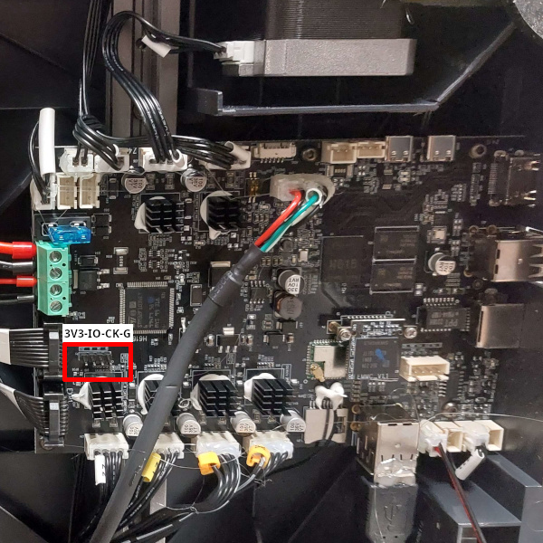
  
  ### Toolhead ST-Link pins location:
  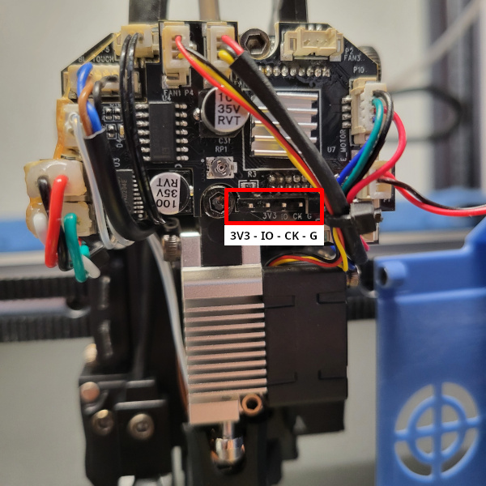

4. Insert the ST-Link into your computer (_printer stays off_), open the STM32CubeProgrammer software, and press CONNECT. It should now connect and populate the middle screen with memory stuff.
5. Please select `Read all` from the `Read` menu, this will read everything and set the correct size (to save).

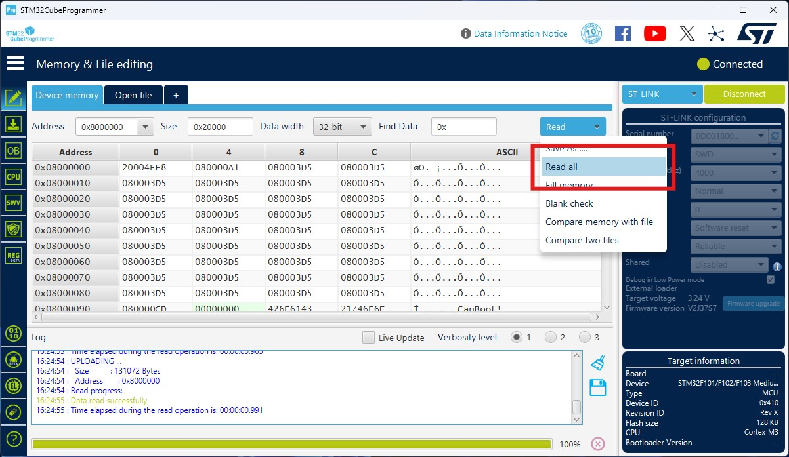

6. Please select `Save As ..` from the `Read` menu and save the current firmware (e.g. _toolhead_original_firmware.bin_ or _mainboard_original_firmware.bin_).

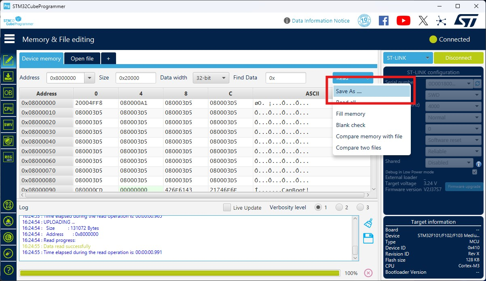

> [!CAUTION]
> Make sure the firmware backup file is 128k. If it is 1 Kilobyte it is too small, and you won't be able to return to the old firmware.
> In case that already happened here is a <a href="firmware-backups/toolhead-0x80000000-sv08-20040628.bin">firmware backup</a> of a SV08 tool head, printer delivered to the EU on 2024-06-28.

<br>

# STEP 7 - FLASH KATAPULT BOOTLOADER

> [!IMPORTANT]
> When connecting the ST-Link to the printer, make sure the printer is powered OFF. The MCU will be powered by the ST-Link.<br>
> Also make sure your ST-Link has the latest firmware, use the STM32CubeProgrammer application 'Firmware upgrade' button for this.

To make life easier in the future we are going to flash Katapult to our MCUs (we flash Katapult on both the mainboard MCU _and_ the toolhead MCU). This is a bootloader that makes it possible to flash Klipper firmware without the ST-Link via CANBus, USB or UART by the Host.

1. Switch the printer on, SSH into the printer, and install Katapult:

   - Run this command to install Katapult: <br>

   ```bash
   cd ~ && git clone https://github.com/Arksine/katapult
   ```

   - Install pyserial with _(we need this later to flash the firmware)_<br>

   ```bash
   pip3 install pyserial
   ```

2. When it's done, do <br>

   ```bash
   cd ~/katapult && make menuconfig
   ```

   In menuconfig select the following options :<br>
   <br>

3. Press Q to quit and save changes.<br>
4. Run the commands to build the firmware (_katapult.bin_):<br>

   ```bash
   make clean
   make
   ```

5. Grab the file `~/katapult/out/katapult.bin` (e.g. with an SFTP program like WinSCP) and store it on the computer. You can use this Katapult firmware for both the tool head and the mainboard.
6. _Turn OFF the printer_ again and after it's off insert the ST Link again into the computer and start the STM32CubeProgrammer software and CONNECT.
7. Once connected, on the left side of the software go to the tab 'Erasing & Programming' and execute a _manual (**not** only automatic mode)_ `Full chip erase`

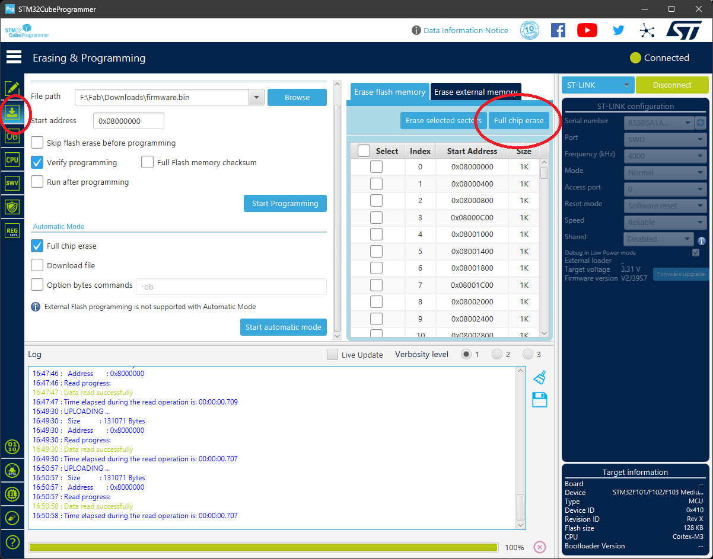

8. Time to flash! Go back to the 'Memory & File editing' tab, click 'Open file', and select the `katapult.bin`, then press the 'Download' button to write the firmware.<br>
<sub>Alternatively you can write the firmware from the 'Erasing & Programming' tab by using 'Browse' to select the `katapult.bin` file and then press 'Start Programming' to write the firmware.</sub>

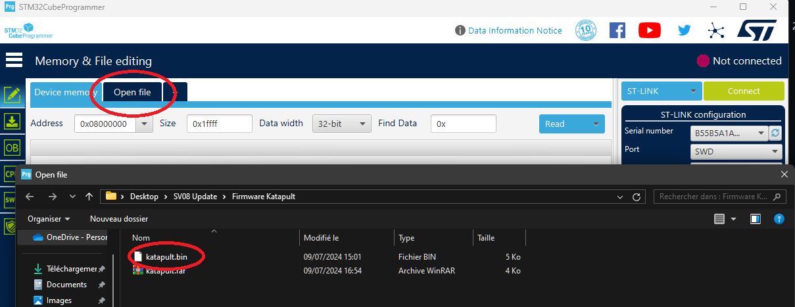<br>

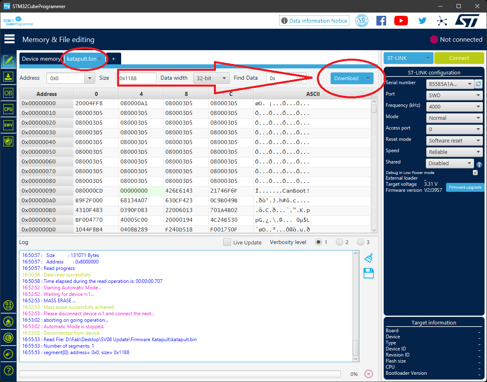<br>

Done! The Katapult bootloader is on the MCU! Please click on 'Disconnect' and then remove the ST-Link from the computer and the board. Do this for both the tool head MCU and the mainboard MCU.

<br>

# STEP 8 - FLASH KLIPPER FIRMWARE on MCUs

> [!NOTE]
> The standard Klipper firmware works on both the toolhead MCU and the mainboard MCU. Originally Sovol made multiple changes to the `stm32f1.c` source for the firmware but they are not mandatory. Only now, the printer starts up silently; no fans, no light, and no display during boot. You CAN get some of this functionality back by enabling GPIO pins during startup, see notes below make menuconfig.

> [!TIP]
> For future Klipper firmware updates, after completing the steps below, you only have to run the script at step `8.7`.

It's time to create and flash the Klipper firmware! In the future, you only have to do this step when you need to update your Klipper firmware. _This section assumes you already have **Katapult** flashed and **pyserial** (step 7.1) installed._

1. Switch on the printer and SSH into the printer.

2. Open the file printer.cfg. Look at the `[mcu]` and `[extra_mcu]` sections, and copy-paste only the section circled in red for each MCU, we will need it later:

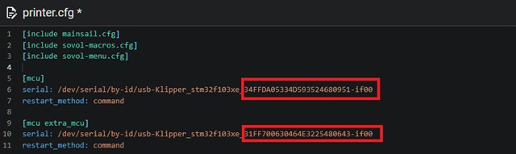

- If you have this in your printer.cfg:

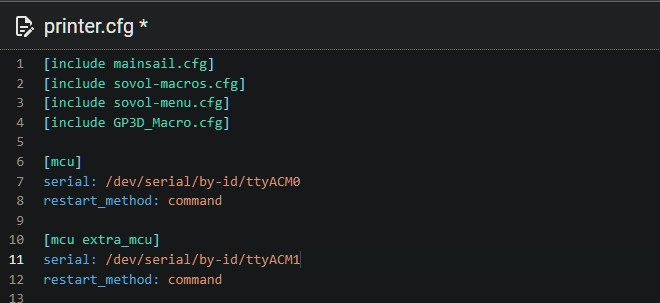

You have to replace each ID to have the same pattern as above. To do that, find the correct serial name for the MCU with the command. **AND READ THE WARNING BELOW!**<br>

```bash
ls -la /dev/serial/by-id/
```

You will have this :

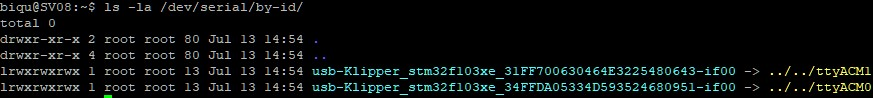

Copy the blue part to replace `ttyACM0` or `ttyACM1` in your printer.cfg. At the end, you should have this (with your digits):


> [!WARNING]
> **WARNING**: When you accidently switch the `mcu` and `extra_mcu` serials bad things can happen. _**THE HEATER WILL TURN ON FULL BLAST!**_ This is bad, you don't want this.
<br><br>
Also **DON'T** use *ttyACM0* and *ttyACM1* as serials, they are not fixed and can switch and give this dangerous effect as well. There is a reason we want you to use the long (and fixed/static) serial.
<br><br>
To be 100% sure you have the correct serial linked to the correct MCU please check your serials with `ls /dev/serial/by-id/` and **disconnect** the USB plug from the **toolhead** (_see image below_). Do a `ls /dev/serial/by-id/` again and see what serial is still there (this is your `mcu` serial) and what serial disappeared (this is your `extra_mcu` serial). Plug the connector back in and do another `ls /dev/serial/by-id/` to confirm you have indeed the correct `mcu` and `extra_mcu` serials.

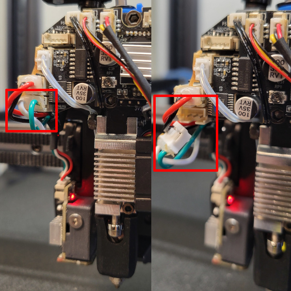

> [!NOTE]
> The correct serial for our MCU's in the printer.cfg always begins with **`usb-Klipper_stm32f103xe_`**. If you only found serials that start with `usb-Katapult_stm32f103xe_` when doing _`ls /dev/serial/by-id/`_ please replace `Katapult` with `Klipper` for the serials in your printer.cfg. <sub>It is possible your serials only contain `usb-Katapult_stm32f103xe_` at the moment because the MCU is already in DFU mode, ready to receive the Klipper firmware. After flashing the Klipper firmware it will become `usb-Klipper_stm32f103xe_`.</sub>

3. Download the script  [Automatic MCU script update](<Automatic MCU script update/>) and copy it in your `~/klipper` folder on the printer.

4. Edit it with nano to change the ID of each MCU with what you have copied at [2](#step-8---flash-klipper-firmware-on-mcus):
```batch
sudo nano ~/klipper/update_klipper_mcus_sv08.sh
``` 
- Replace XXXXXXX with the `[mcu]` serial ID, and YYYYYYY with the `[extra mcu]` serial ID :

*printer.cfg<br>*
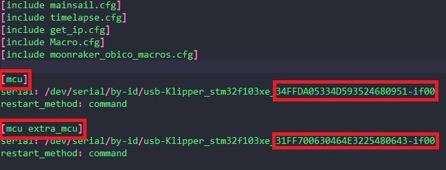

*update_klipper_mcus_sv08.sh<br>*
```bash
#Replace each XXXXXXXX and YYYYYYYY serial number with the one you find in your printer.cfg file (we only need the part after 'usb-Klipper_stm32f103xe_')
#HOSTSERIAL is found under [mcu]
#TOOLHEADSERIAL is found under [extra mcu]

# I'm a string, so I look like: HOSTSERIAL='XXXXXXXX'
HOSTSERIAL='XXXXXXXX'

# I'm an array so I look like: TOOLHEADSERIAL=('YYYYYYY')
# For multiple serials/toolheads use (mind the space in between items!): TOOLHEADSERIAL=('YYYYYYYY1' 'YYYYYYYY2' 'YYYYYYY3')
TOOLHEADSERIAL=('YYYYYYY')
```
- You should now have this in the script :

```bash
#Replace each XXXXXXXX and YYYYYYYY serial number with the one you find in your printer.cfg file (we only need the part after 'usb-Klipper_stm32f103xe_')
#HOSTSERIAL is found under [mcu]
#TOOLHEADSERIAL is found under [extra mcu]

# I'm a string, so I look like: HOSTSERIAL='XXXXXXXX'
HOSTSERIAL='32FFD9054747363035861857-if00'

# I'm an array so I look like: TOOLHEADSERIAL=('YYYYYYY')
# For multiple serials/toolheads use (mind the space in between items!): TOOLHEADSERIAL=('YYYYYYYY1' 'YYYYYYYY2' 'YYYYYYY3')
TOOLHEADSERIAL=('50FF6C068367515511180667-if00')


```
5. Save the file with `Ctrl + X`

6. Make the script executable :
```bash
sudo chmod +x ~/klipper/update_klipper_mcus_sv08.sh
```

7. You can now use the script with :
```bash
cd "$HOME/klipper" && ./update_klipper_mcus_sv08.sh
```

8. In the MCU updater menu choose option 1 'HOST MCU'. In the menuconfig screen for the **`HOST`**,choose the following option(s) and add `PA1,PA3` on the last line (_GPIO pins_ , if you want _MCU fan and light_ during boot), when ready press Q to quit & save. Continue to follow instructions and flash the HOST MCU.<br>

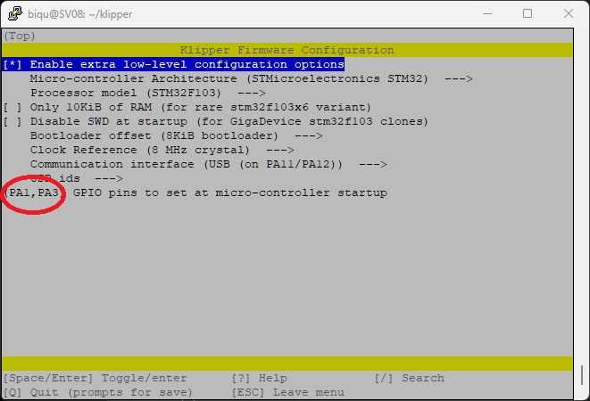

> [!NOTE]
> <sub>Because we are using Katapult as the bootloader, make sure you set the 8 KiB bootloader offset.</sub><br>

9. In the MCU updater menu choose option 2 'TOOLHEAD MCU(S)'. In the menuconfig screen for the **`TOOLHEAD`**,choose the following option(s) and add `PA6` on the last line (_GPIO pins_ , if you want _hotend fan_ enabled during boot), when ready press Q to quit & save. Continue to follow instructions and flash the TOOLHEAD MCU.<br>

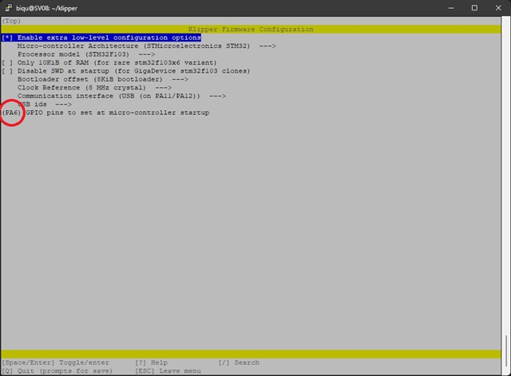

> [!NOTE]
> <sub>Because we are using Katapult as the bootloader, make sure you set the 8 KiB bootloader offset.</sub><br>

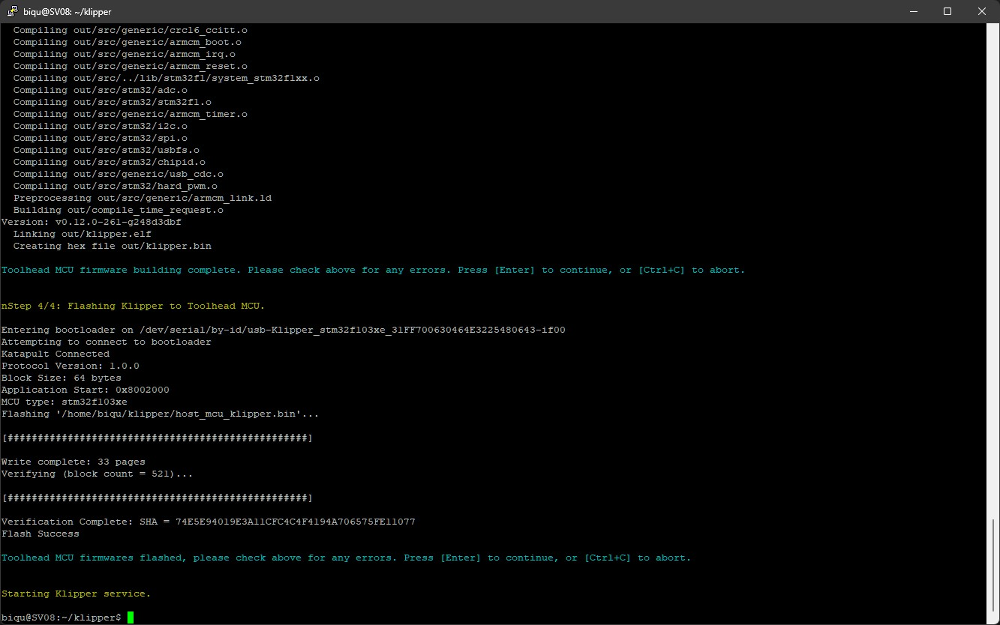

10. Done! The Klipper firmware on both MCU has been updated.

11. Restart the printer :
```bash
sudo shutdown -r now
```

12. After the restart, you can *un*comment the `[adxl345]` and `[resonance_tester]` parts in your printer.cfg to have those functional again

13. Enjoy mainline Klipper ! 

<br>

# BIG THANKS & CONTRIBUTE

Big thanks to all the people on the Sovol discords (both official and unofficial) who have helped or participated in this project in any way.
Special thanks go out to: ss1gohan13, michrech, Zappes, cluless, Haagel, Froh - _you guys rock!_

Do you feel like contributing to this project/guide? That would be awesome! Please make a pull request or issue and then it can be added to the guide!

<br>

# Disclaimer

This guide and all changes have been made with the best intentions but in the end, it's your responsibility and _only your responsibility_ to apply those changes and modifications to your printer. Neither the author, contributors nor Sovol is responsible if things go bad, break, catch fire, or start WW3. You do this at your own risk!
