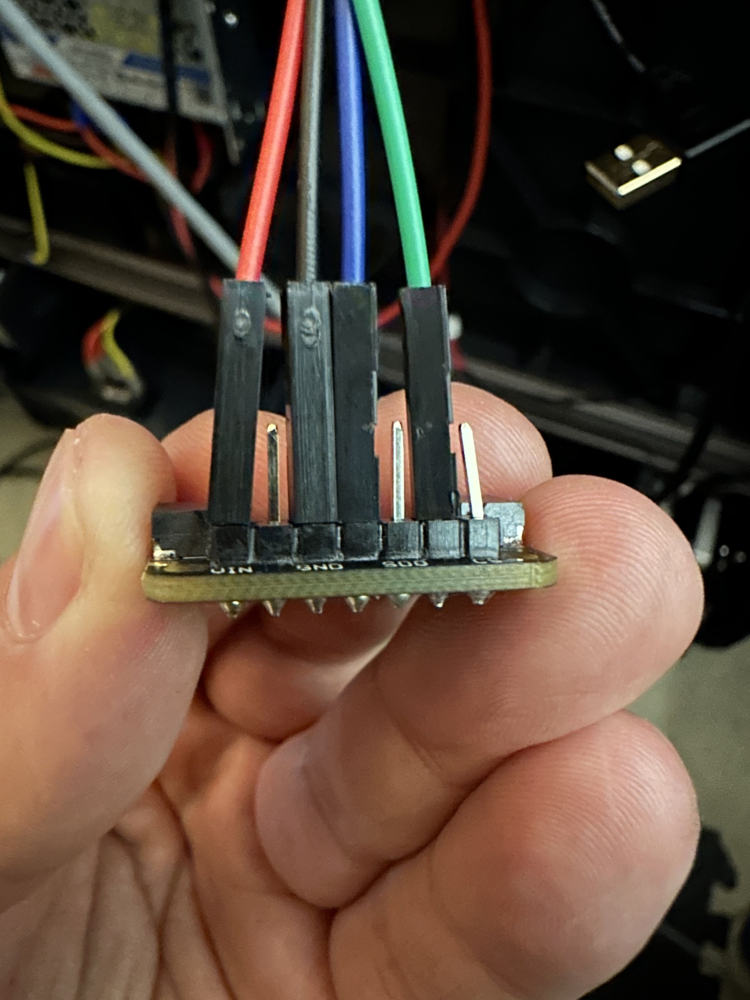
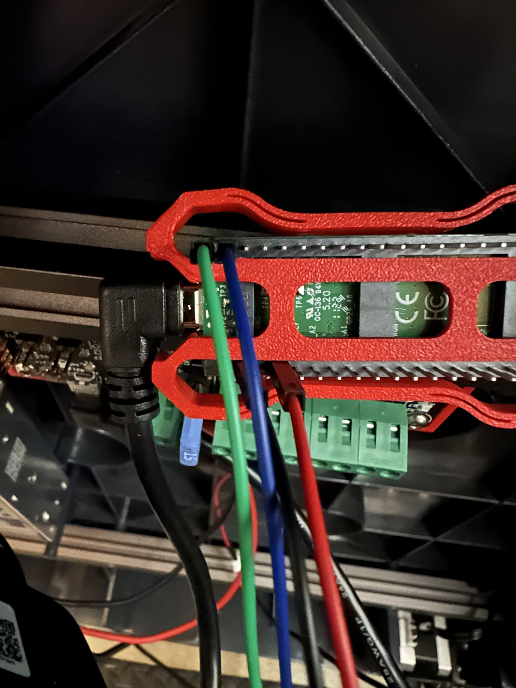

# PREREQUISITES

- [Raspberry Pi Pico](https://www.raspberrypi.com/products/raspberry-pi-pico/)
- [USB cable for Pico](https://www.amazon.com/Amazon-Basics-Charging-Transfer-Gold-Plated/dp/B071S5NTDR/ref=sr_1_3?crid=2SPV98K02ZSYV&dib=eyJ2IjoiMSJ9._kWACzPr7VZO-DFQ1INV-fqAyvsmdHWuC6kbyrgOI8c9G3EKz1AH_X56OC4EJDh8VFGszrj5RI8tpTm0tflxQq1WcKJJwQwEVleLLWjS_6M4v13_tVJW-_sCzHiREPrY77OZFyeEmd54k4UbvOlZR08PMM95EzRxLawdB765mR12SGGfqpDmBtcYB3TwqTnIDdvwVf8YREoyzR58rG54nWoPQydHJoRtD1d0aFjHxg0.DSJs_KKHBuYPc7wPoRVDeBsSQuKAo-gDpBK4wFfSsLA&dib_tag=se&keywords=micro+usb+cable&qid=1736986521&sprefix=micro+usb+cabl%2Caps%2C131&sr=8-3)
- [BMP 280 thermistor](https://www.adafruit.com/product/2651)
- [22-26 awg wiring](https://www.amazon.com/dp/B089D29FHC/?coliid=IBSXSVAK8GF72&colid=2P726BLZ31XZF&psc=1&ref_=list_c_wl_lv_ov_lig_dp_it)
- [pico mount](https://www.printables.com/model/835820-raspberry-pi-pico-mount)
- [no t-nut pico mount](https://www.printables.com/model/513850-pico-caddy-no-screw-2020-connect)
- solder, soldering iron, and light soldering skills

# STEPS

1. Print Pico mount

2. While printing, prep Pico cables, and thermistor

   </a>

4. Flash Pico
  

5. Mount & plug in Pico

  </a>

5. Find device ID for Pico


6. Edit the Pico.cfg with your proper device ID

```py
[mcu pico]
serial: /dev/serial/by-id/usb-Klipper_rp2040_E6635C08CB096C2C-if00
restart_method: command
```

7. Save and restart firmware

