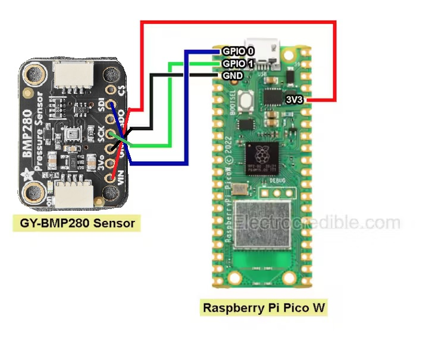
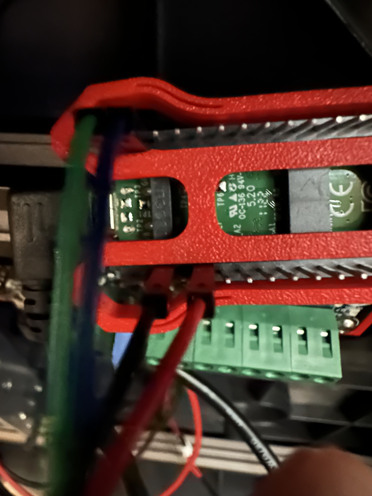

# PREREQUISITES

- [Raspberry Pi Pico](https://www.raspberrypi.com/products/raspberry-pi-pico/)
- [USB cable for Pico](https://www.amazon.com/Amazon-Basics-Charging-Transfer-Gold-Plated/dp/B071S5NTDR/ref=sr_1_3?crid=2SPV98K02ZSYV&dib=eyJ2IjoiMSJ9._kWACzPr7VZO-DFQ1INV-fqAyvsmdHWuC6kbyrgOI8c9G3EKz1AH_X56OC4EJDh8VFGszrj5RI8tpTm0tflxQq1WcKJJwQwEVleLLWjS_6M4v13_tVJW-_sCzHiREPrY77OZFyeEmd54k4UbvOlZR08PMM95EzRxLawdB765mR12SGGfqpDmBtcYB3TwqTnIDdvwVf8YREoyzR58rG54nWoPQydHJoRtD1d0aFjHxg0.DSJs_KKHBuYPc7wPoRVDeBsSQuKAo-gDpBK4wFfSsLA&dib_tag=se&keywords=micro+usb+cable&qid=1736986521&sprefix=micro+usb+cabl%2Caps%2C131&sr=8-3)
- [BMP 280 thermistor](https://www.adafruit.com/product/2651)
- [22-26 awg wiring](https://www.amazon.com/dp/B089D29FHC/?coliid=IBSXSVAK8GF72&colid=2P726BLZ31XZF&psc=1&ref_=list_c_wl_lv_ov_lig_dp_it)
- [pico mount](https://www.printables.com/model/835820-raspberry-pi-pico-mount)
- [no t-nut pico mount](https://www.printables.com/model/513850-pico-caddy-no-screw-2020-connect)
- solder, soldering iron, and light soldering skills

# STEPS

1. Print Pico mount

2. While printing, prep Pico cables, and thermistor

   </a>
   </a>
   
   </a>
   </a>

3. Mount pico to extrusion under the printer & plug in Pico into any open USB port on SV08 mainboard.

   </a>
   

4. Flash Pico

   

5. Find device ID for Pico
* SSH into the SV08, compile the firmware for the Pico

   ```properties
   cd ~/klipper
   make clean
   make menuconfig
   ```
* Now, while holding down the `BOOTSEL` button on the Pico, connect the Pico to the SV08 via USB. Compile and flash the firmware.

   `make flash FLASH_DEVICE=first`

   If that fails, you will be told which `FLASH_DEVICE` to use. In this example, that's make flash `FLASH_DEVICE=2e8a:0003`.

   

   The Pico will now reboot with the new firmware and should show up as a serial device. Find the pico serial device with `ls /dev/serial/by-id/*`. You can now add an `pico.cfg` file with the following settings:

   

6. Edit the Pico.cfg with your proper device ID

   ```properties
   [mcu pico]
   serial: /dev/serial/by-id/usb-Klipper_rp2040_<YOUR-PICO-ID-HERE>   #example: serial: /dev/serial/by-id/usb-Klipper_rp2040_E6635C08CB096C2C-if00
   restart_method: command

   [temperature_sensor chamber]
   sensor_type: BME280
   min_temp: 0
   max_temp: 65
   i2c_address: 119
   #   Default is 118 (0x76). The BMP180, #BMP388 and some BME280 sensors
   #   have an address of 119 (0x77).
   i2c_mcu: pico
   #   The name of the micro-controller that the chip is connected to.
   #   The default is "mcu".
   i2c_bus: i2c0a
   #   If the micro-controller supports multiple I2C busses then one may
   #   specify the micro-controller bus name here. The default depends on
   #   the type of micro-controller.
   #i2c_software_scl_pin:
   #i2c_software_sda_pin:
   #   Specify these parameters to use micro-controller software based
   #   I2C "bit-banging" support. The two parameters should the two pins
   #   on the micro-controller to use for the scl and sda wires. The
   #   default is to use hardware based I2C support as specified by the
   #   i2c_bus parameter.
   #i2c_speed:
   #   The I2C speed (in Hz) to use when communicating with the device.
   #   The Klipper implementation on most micro-controllers is hard-coded
   #   to 100000 and changing this value has no effect. The default is
   #   100000. Linux, RP2040 and ATmega support 400000.
   gcode_id:

   [gcode_macro _QUERY_BME280]
   gcode:
       
       {action_respond_info(
           "Temperature: %.2f C\n"
           "Pressure: %.2f hPa\n"
           "Humidity: %.2f%%" % (
               sensor.temperature,
               sensor.pressure,
               sensor.humidity))}
   ```

7. Save and restart firmware

